<p align="center">
  
</p>

<p align="center">
  <a href="https://termly.cc"></a>
  <a href="#"></a>
</p>

<p align="center">
  
  
  
  
  
  
  
</p>

---

# Termly

> AI-powered covenant monitoring platform for commercial lenders.

Termly extracts covenants from loan documents and monitors compliance across your portfolio. The AI assistant (Monty) lets you query data, create memos, and take actions through natural conversation.

---

## Features

| Feature | Description |
|---------|-------------|
| **AI Document Extraction** | Upload PDFs, AI extracts covenants, EBITDA definitions, and financial data in seconds |
| **Covenant Monitoring** | Track compliance status (compliant, warning, breach) across all loans |
| **Smart Alerts** | Get notified before covenants breach, not after |
| **Credit Memos** | Generate AI-written compliance memos with one click |
| **AI Assistant (Monty)** | Query your portfolio in plain English, create records, take actions |
| **Audit Trail** | Full history of all actions for regulatory compliance |

---

## Screenshots

### AI Document Extraction
Upload loan agreements and let AI extract the data automatically.


---

### Meet Monty - Your AI Assistant
Ask questions, get answers, take actions through conversation.


---

### Portfolio Dashboard
See all your loans and covenant status at a glance.


---

### Early Warning Alerts
Get notified when covenants approach breach thresholds.


---

### AI Analytics
Get insights about your portfolio performance.


---

### Auto Credit Memos
Generate compliance memos with proper formatting.


---

### Full Audit Trail
Every action tracked for compliance.


---

## Architecture


---

## System Flow


---

## AI Document Extraction Flow


---

## Monty Agent Flow

```mermaid
flowchart TD
    A[💬 User Message] --> B[Monty AI Agent]

    B --> C{Needs Data?}

    C -->|Yes| D[Execute Read Tools]
    C -->|No| E{Needs Action?}

    D --> F[Query Database]
    F --> G[Process Results]
    G --> B

    E -->|Yes| H[Execute Write Tools]
    E -->|No| I[Generate Response]

    H --> J[Update Database]
    J --> K[Log to Audit Trail]
    K --> I

    I --> L[📨 Send Response to User]

    subgraph Tools["🔧 Available Tools"]
        D --> D1[get_loans]
        D --> D2[get_alerts]
        D --> D3[get_portfolio_summary]
        H --> H1[create_loan]
        H --> H2[create_memo]
        H --> H3[acknowledge_alert]
    end
```



---

## Data Flow

```mermaid
flowchart LR
    subgraph Ingest["📥 Data Ingestion"]
        PDF[PDF Upload]
        Manual[Manual Entry]
        API[API Import]
    end

    subgraph Process["⚙️ Processing"]
        Extract[AI Extraction]
        Validate[Validation]
        Calculate[Ratio Calculation]
    end

    subgraph Store["💾 Storage"]
        DB[(Database)]
        Files[(File Storage)]
    end

    subgraph Monitor["📊 Monitoring"]
        Alerts[Alert Engine]
        Dashboard[Dashboard]
        Reports[Reports]
    end

    PDF --> Extract
    Manual --> Validate
    API --> Validate

    Extract --> Validate
    Validate --> Calculate
    Calculate --> DB
    PDF --> Files

    DB --> Alerts
    DB --> Dashboard
    DB --> Reports

    Alerts -->|Breach| Notify[🔔 Notifications]
    Alerts -->|Warning| Notify
```



---

## Monty's Capabilities

### Read Operations
| Tool | Description |
|------|-------------|
| `get_portfolio_summary` | Portfolio overview with totals and compliance stats |
| `get_loans` | List loans with filtering by status |
| `get_loan_details` | Detailed loan info with covenants |
| `get_alerts` | Get alerts filtered by severity |
| `get_covenants_in_breach` | All breached covenants |
| `get_covenants_at_warning` | Covenants near breach |
| `get_financial_periods` | Financial data by period |
| `get_risk_scores` | Risk assessment by borrower |
| `get_memos` | List credit memos |
| `get_audit_log` | Recent audit entries |

### Write Operations
| Tool | Description |
|------|-------------|
| `create_loan` | Create a new loan |
| `create_borrower` | Add a new borrower |
| `create_covenant` | Add covenant to loan |
| `record_covenant_test` | Record test result |
| `create_memo` | Generate credit memo |
| `acknowledge_alert` | Mark alert as reviewed |
| `escalate_alert` | Escalate to critical |

---

## Tech Stack

| Layer | Technology |
|-------|------------|
| **Frontend** | Next.js 15, React 19, TypeScript |
| **Styling** | Tailwind CSS, Shadcn/ui |
| **Database** | Supabase (PostgreSQL) |
| **Auth** | Clerk |
| **AI** | Anthropic API |
| **Storage** | Supabase Storage |
| **Deployment** | Vercel |

---

## Getting Started

### Prerequisites
- Node.js 18+
- npm or yarn
- Supabase account
- Clerk account
- Anthropic API key

### Installation

```bash
# Clone the repository
git clone https://github.com/brn-mwai/termly-LMA-Hackathon.git
cd termly-LMA-Hackathon

# Install dependencies
npm install

# Set up environment variables
cp .env.example .env.local
# Fill in your API keys

# Run database migrations
npx supabase db push

# Seed demo data (optional)
npm run seed:demo

# Start development server
npm run dev
```

### Environment Variables

```env
# Clerk Authentication
NEXT_PUBLIC_CLERK_PUBLISHABLE_KEY=
CLERK_SECRET_KEY=

# Supabase
NEXT_PUBLIC_SUPABASE_URL=
NEXT_PUBLIC_SUPABASE_ANON_KEY=
SUPABASE_SERVICE_ROLE_KEY=

# AI
ANTHROPIC_API_KEY=

# App
NEXT_PUBLIC_APP_URL=http://localhost:3000
```

---

## Project Structure

```
termly/
├── src/
│   ├── app/                    # Next.js app router
│   │   ├── (dashboard)/        # Dashboard pages
│   │   ├── (auth)/             # Auth pages
│   │   ├── (landing)/          # Landing page
│   │   └── api/                # API routes
│   ├── components/             # React components
│   │   ├── ui/                 # Shadcn components
│   │   ├── chat/               # Monty chat UI
│   │   ├── loans/              # Loan components
│   │   └── documents/          # Document components
│   ├── lib/                    # Utilities
│   │   ├── ai/                 # AI client & tools
│   │   ├── supabase/           # Database client
│   │   └── utils/              # Helper functions
│   └── types/                  # TypeScript types
├── public/                     # Static assets
├── supabase/                   # Database migrations
└── package.json
```

---

## Database Schema

### Core Tables

| Table | Purpose |
|-------|---------|
| `organizations` | Multi-tenant organizations |
| `users` | User accounts linked to Clerk |
| `borrowers` | Borrower companies |
| `loans` | Loan facilities |
| `covenants` | Covenant definitions |
| `covenant_tests` | Test results history |
| `documents` | Uploaded documents |
| `alerts` | Compliance alerts |
| `memos` | Credit memos |
| `audit_logs` | Action history |

---

## API Reference

### Chat API
```
POST /api/chat
Body: { message: string, history: Message[] }
Response: { message: string, actions: Action[] }
```

### Documents API
```
POST /api/documents/upload
Body: FormData (file, loan_id, type)

POST /api/documents/[id]/extract
Triggers AI extraction
```

### Actions API
```
POST /api/actions
Body: { action: string, params: object }
Executes agentic actions (create, update, delete)
```

---

## Demo

**Live Demo:** [termly.cc](https://termly.cc)

**Demo Credentials:** Sign up with any email to explore the platform.

---

## Built For

<p align="center">
  <strong>LMA EDGE Hackathon 2025</strong>
</p>

---

## Team

Built by **Brian Mwai**

---

## License

MIT License
